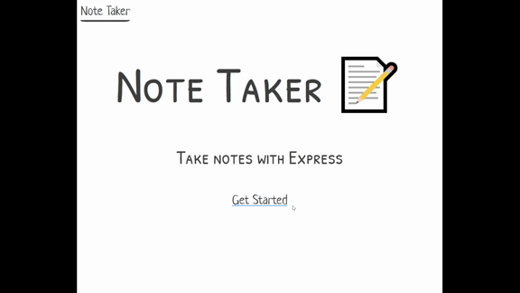

# Note-Taker

An application that can be used to write, save, and delete notes.
This application will use an express backend and save and retrieve note data from a JSON file.
created using:
Node.JS
HTML
Paper.css
Javascript

Note-Taker screenshot

application gif

